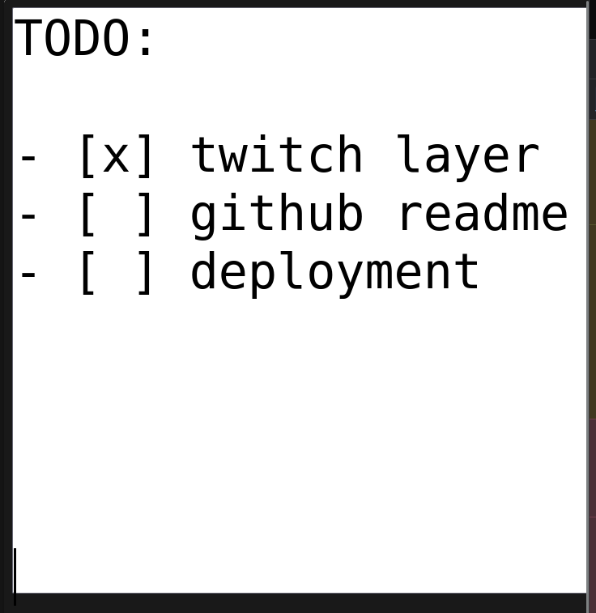
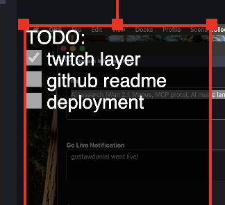

# Twitch Layer

This is a Meteor app that allows you to create a layer on top of Twitch.tv.





## Installation

1. Clone the repository
2. Run `meteor npm install`
3. Run `meteor`

## Usage

1. Go to `http://localhost:3000`
2. Open OBS Studio
3. Add a new Browser Source
4. Set the URL to `http://localhost:3000`

Shortcuts on main page:
- To edit: `e`
- To stats `s`

Features
--------

-   [x] Create a Browser layer for OBS
-   [x] Add a text layer
-   [x] Measurement of Twitch stats to save locally
-   [ ] clickable checkboxes (now you can edit by text)
-   [ ] access by deployed url (now only by localhost)


## License

WTFPL
```
            DO WHAT THE FUCK YOU WANT TO PUBLIC LICENSE
                    Version 2, December 2004

 Copyright (C) 2004 Sam Hocevar <sam@hocevar.net>

 Everyone is permitted to copy and distribute verbatim or modified
 copies of this license document, and changing it is allowed as long
 as the name is changed.

            DO WHAT THE FUCK YOU WANT TO PUBLIC LICENSE
   TERMS AND CONDITIONS FOR COPYING, DISTRIBUTION AND MODIFICATION

  0. You just DO WHAT THE FUCK YOU WANT TO.
```

## Libraries used

- [Vue3](https://v3.vuejs.org/)
- [Vite](https://vitejs.dev/)
- [Vue Router](https://next.router.vuejs.org/)
- [Meteor](https://www.meteor.com/)
- [Vue Meteor Tracker](https://github.com/meteor-vue/vue-meteor-tracker)
- [Tailwind CSS](https://tailwindcss.com/)
